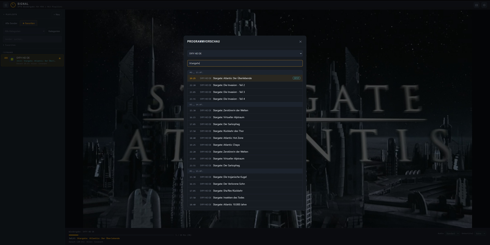

# SIGNAL IPTV Player

SIGNAL ist ein lokaler IPTV-Player für M3U- und HLS-Playlists.  
Die Anwendung läuft als einzelne HTML-Datei direkt im Browser und unterstützt EPG-Daten im XMLTV-Format.

## Funktionen

- Wiedergabe von M3U- und M3U8/HLS-Playlists
- Playlist-Import per URL oder Datei
- EPG-Unterstützung per XMLTV-URL oder XML/XML.GZ-Datei
- Favoritenliste
- Kategorien umbenennen oder ausblenden
- Programmliste mit Suchfunktion
- Audio- und Untertitel-Auswahl, sofern vom Stream angeboten
- Lokale Speicherung von Playlists, Favoriten und Einstellungen
- Optionaler lokaler Proxy für Server mit CORS-Sperre
- Keine externen CDNs, Fonts oder Tracking-Dienste

## Nutzung

1. `iptv_player.html` herunterladen.
2. Datei im Browser öffnen.
3. Playlist per URL oder Datei hinzufügen.
4. Sender auswählen und abspielen.
5. Optional eine EPG-Quelle zur Playlist hinzufügen.

## Lokale Speicherung

SIGNAL speichert die Konfiguration lokal im Browser.  
In unterstützten Browsern kann zusätzlich ein Ordner verknüpft werden. Dort wird die Datei `signal-config.json` angelegt und automatisch aktualisiert.

Gespeichert werden unter anderem:

- Playlists
- Favoriten
- Kategorie-Anpassungen
- Einstellungen
- zuletzt gesehener Sender
- EPG-Quellen

## EPG und CORS

Manche EPG- oder Playlist-Server blockieren direkte Browser-Anfragen durch CORS-Regeln.
Drei Eingebaute optionen:
1. URL funktioniert direkt und es gibt kein CORS probleme.
2. URL funktioniert nicht, und ein Umweg über ein CORS-Public-Proxy wird genutzt, aber nur wenn der lokale python Proxy nicht läuft.
3. Lokaler (python) Proxy verwendet: Dieser läuft nur auf: `127.0.0.1:8787`. Hat vorrang gegenüber Punkt 2 mit dem Öffentlichen Proxy. 
> Der Python Proxy kann über das Einstellungs-Zahnrad oben rechts gefunden und als python-code abgespeichert werden.

---

# Lizenz

Dieses Projekt unterliegt einer benutzerdefinierten, nicht-kommerziellen Lizenz – siehe LICENSE. Die nicht-kommerzielle Nutzung, Vervielfältigung und Änderung sind gestattet; die kommerzielle Nutzung bedarf der vorherigen schriftlichen Genehmigung des Autors.

Haftungsausschluss: Diese Software wird "wie besehen" bereitgestellt. Es wird keine Haftung für Datenverluste oder Sicherheitsvorfälle übernommen. Die Nutzung erfolgt auf eigene Gefahr.